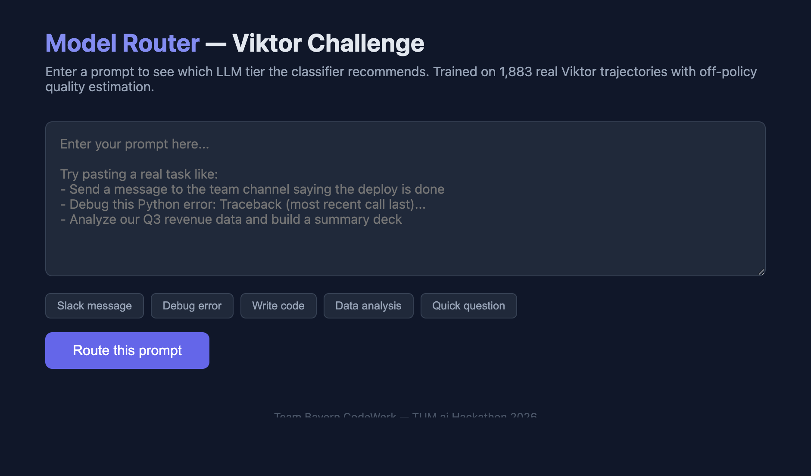
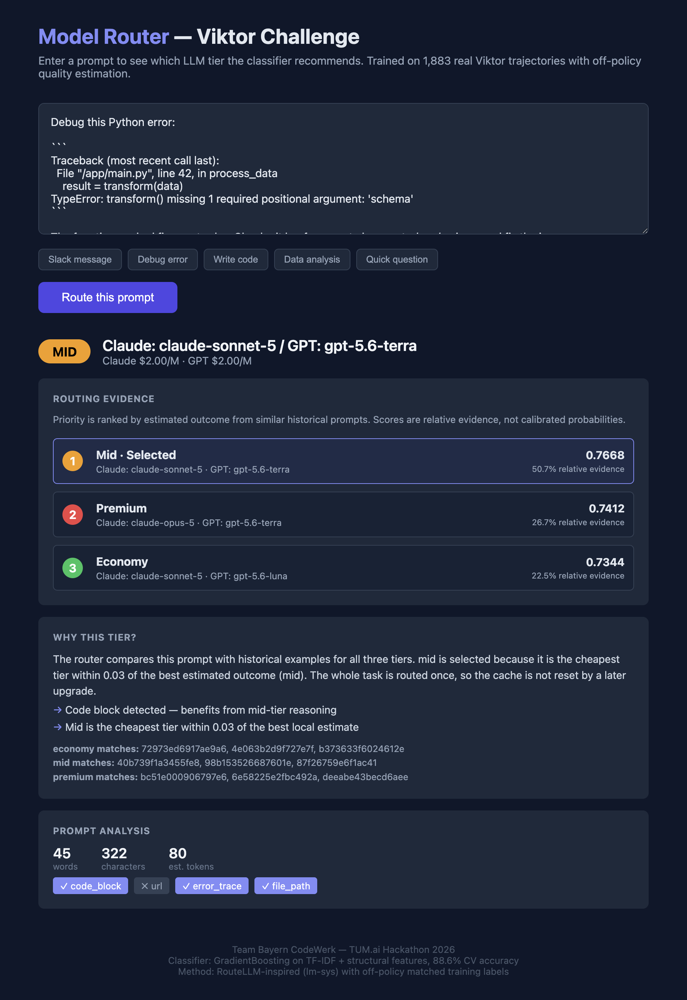
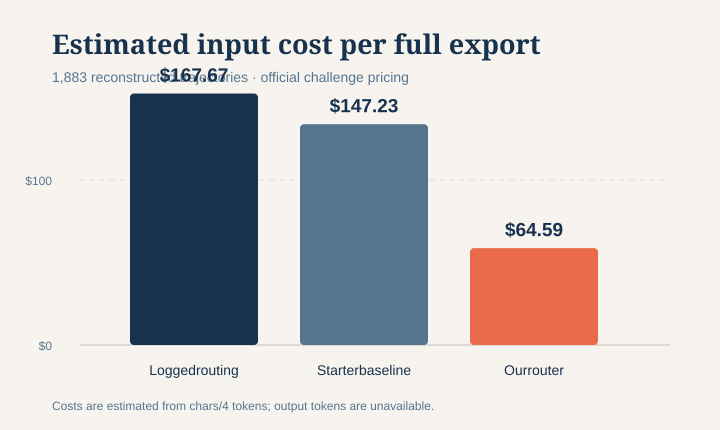

# Viktor Model Router

An explainable, offline model router for the Viktor challenge. It learns from
historical request trajectories, estimates which tier is safest for a new prompt,
and makes one whole-trajectory decision before execution.





The initial view accepts a prompt. The routed view ranks all three tiers, shows
the model candidates, gives the estimated outcome for each, and lists the
historical trajectories used as evidence.

## Quick start

```bash
# Optional: generate a synthetic sample if no challenge export is available:
python3 scripts/make_synthetic_sample.py            # writes ./export/

# Inspect and reconstruct trajectories:
python3 scripts/load_trajectories.py export/

# Run the original starter baseline:
python3 scripts/baseline_router.py export/

# Plot the baseline frontier:
python3 scripts/plot_frontier.py results/routes.jsonl
```

## Run this model

The trained router UI uses the RouteLLM-style classifier and nearest historical
trajectory outcomes:

```bash
python3 scripts/router_ui.py 8080
```

Open <http://localhost:8080>.

Retrain the classifier on local challenge exports:

```bash
python3 scripts/routellm_classifier.py export/
```

The trained artifact is `results/routellm_ui_model.pkl`.

## Expanded evaluation

On 2,000 request rows reconstructed into 1,883 trajectories, the logged
baseline cost an estimated `$167.67`. The GitHub starter baseline cost `$147.23`
(`12.2%` savings); this router cost `$64.59` (`61.5%` savings).



See [the full results](docs/RESULTS.md) and [methodology](docs/METHODOLOGY.md)
for assumptions, off-policy quality estimation, and limitations.

Python 3.10+, standard library only (matplotlib optional for the PNG).

## What's here

| Path | What |
|---|---|
| `scripts/baseline_router.py` | Original starter baseline for comparison |
| `scripts/router_ui.py` | Interactive explainable router |
| `scripts/routellm_classifier.py` | Train the classifier and historical reference set |
| `scripts/plot_frontier.py` | Generate the starter cost frontier |
| `docs/` | Methodology, expanded-data results, chart, and UI screenshots |

## Rules that matter

- **License:** challenge use only — no redistribution of the dataset. Full terms ship with the download.
- No GPU or API keys needed. Judge-model rescoring is allowed (credits announced at kickoff).
- All reported costs are estimated input-token costs. Output tokens are unavailable in the export.
